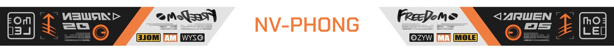
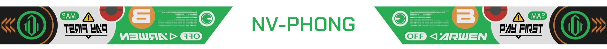

## Hi there 👋
### I'm NV-Phong

- 🔭 I’m currently working on a Full-Stack web application using React and Node.js
- 🌱 I’m currently learning NextJS
- 💬 Ask me about everything
- 📫 How to reach me: you can connect with me on
	> [Pinterest](https://www.pinterest.com/pog_03)
	> or
	> [Facebook](https://www.facebook.com/phong03032003)
- 😄 Pronouns: He/Him
- ⚡ Fun fact: I like to play VSCode

### 🛠️ Technologies and Tools

### 📂 Featured Projects
- [Task Manager](https://github.com/NV-Phong/TM-Beta): A todolist website
- [JWT Authentication](https://github.com/NV-Phong/JWT-Authentication): Support [C#] .NET Core and [Java] SpringBoot 
- [HealthCare](https://github.com/NV-Phong/JWT-Authentication): An Application build on NestJS + Flutter 

### 🔗 Connect with me
- [Pinterest](https://www.pinterest.com/pog_03)
- [Facebook](https://www.facebook.com/phong03032003)
- [Figma](https://www.figma.com/@phong03032003)

