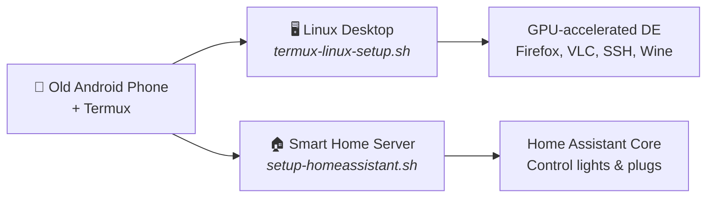

```mermaid
graph LR
    A["📱 Old Android Phone<br/>+ Termux"] --> B["🖥️ Linux Desktop<br/><i>termux-linux-setup.sh</i>"]
    A --> C["🏠 Smart Home Server<br/><i>setup-homeassistant.sh</i>"]
    B --> D["GPU-accelerated DE<br/>Firefox, VLC, SSH, Wine"]
    C --> E["Home Assistant Core<br/>Control lights & plugs"]
```
